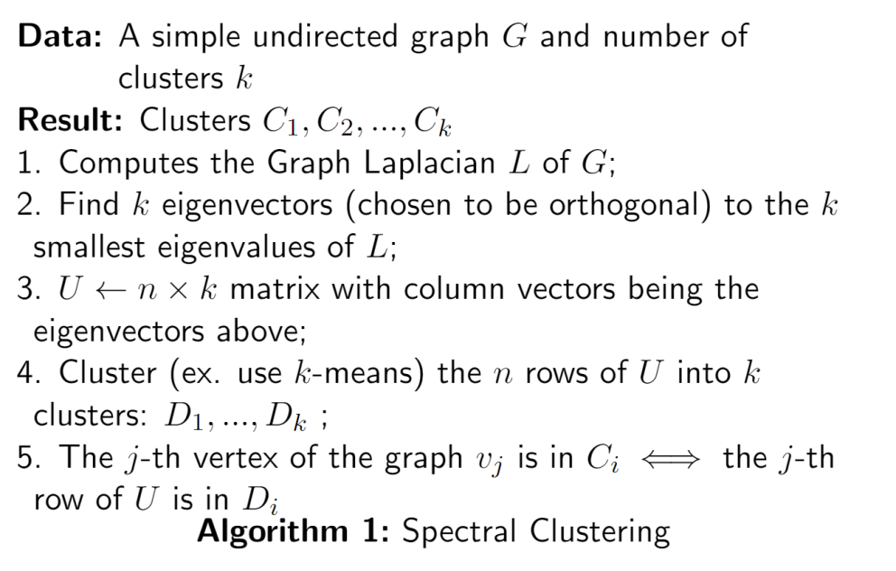
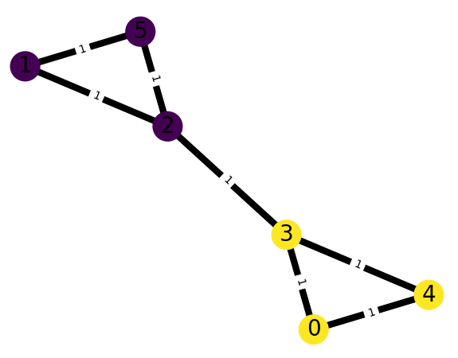
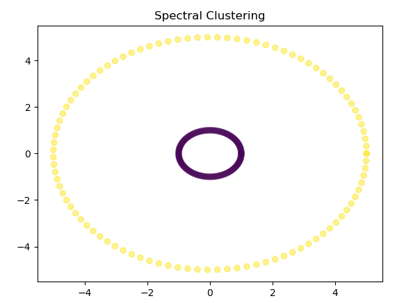
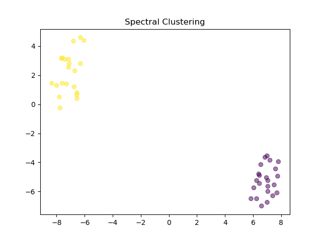
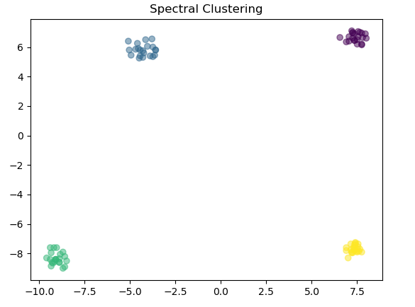

# Algebraic-Connectivity

This is an implementation of the Spectral Clustering algorithm in Python using the concept of Algebraic Connectivity. For an introduction to these two topics, please check out our presentation [here](presentation/presentation.pdf).<br />

The algorithm works as follows:


This project was made as part of our final project of **APMA 2812G : Combinatorial Theory** for the Fall 2022 Semester.
## Input Specification
We will explain how the input files should be formatted here, note that you can find some examples under the example [folder](example/). <br/>

The program takes in a text file of the following format:
- The first line of the file is as follows:
```
<Number of Nodes/Points> <Type of Input> <Additional Information>
```
We currently support 3 types of file inputs:
| Type of Input      | File Type |
| ----------- | ----------- |
| g | weighted graph       |
| e |   data points with epsilon neighborhood   |
| s | data points with similarity function |
### Weighted Graph:
Let n be the number of vertices of the graph. the first line of a weighted graph is as follows:
```
n g
```
The graph will have vertex numbered from 0 to n-1. The $i$-th line after the first line should specify all the neighborhoods of the node $i-1$ and the weight of the edges in an alternating order:
```
<index of neighbor 1> <weight of edge to neighbor 1> ...
```
For example:
```
5 g
3 1 4 1
2 1
1 1 3 1
2 1 0 1 4 1
0 1 3 1
```
### Epsilon Neighborhood:
Let n be the number of data points and m be the epsilon value, then the first line of the file is as follows:
```
n e m
```
All lines after the first line should be the data points given. If the data points are in $\mathbb{R}^d$ with coordinates $x_1, ..., x_d$ then the line should be
```
<x_1 component of the point> ... <x_d component of the point>
```

### Similarity Function
The similarity function we use is the [Gaussian Similarity](https://en.wikipedia.org/wiki/Similarity_measure) with takes in a parameter sigma. Let n be the number of data points , the first line of the file is follows:
```
n s sigma
```
All lines after the first line should be the data points given. If the data points are in $\mathbb{R}^d$ with coordinates $x_1, ..., x_d$ then the line should be
```
<x_1 component of the point> ... <x_d component of the point>
```
## How to Run
To install dependencies (note this program was made in Python 3.7.3)
```
pip install -r requirements.txt
```
To run tests
```
cd tests
pytest
```
To run the clustering method:
```
python3 main.py <path_to_file> <number of clusters K>
```
## Recreate Examples from Presentation
To re-create the examples from our [presentation](presentation/presentation.pdf), run the following commands:
- For the graph: <br/>

```
python3 main.py example/graph/two_triangles.txt 2
```
- For Epsilon Neighborhoods: <br/>

```
python3 main.py example/data/two_epsilon.txt 2
```
- For Similarity Functions: <br/>

```
python3 main.py example/data/two.txt 2
```
- For Four Clusters: <br/>

```
python3 main.py example/data/similarity.txt 4
```
